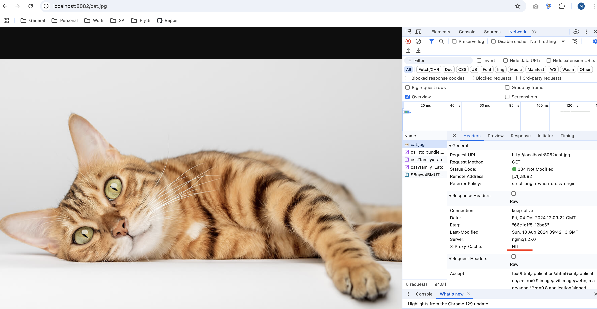

# HSA cdn
Handmade CDN

Define domain for local network with

* [BIND DNS server](https://github.com/sameersbn/docker-bind)
* [BIND docker setup](https://www.damagehead.com/blog/2015/04/28/deploying-a-dns-server-using-docker/)
* [Dnsmasq](https://github.com/strm-containers/docker-dnsmasq)

Check custom dns record setup:
```
host mydomain.local 127.0.0.1
```

Configure local DNS server for MacOS:
```
networksetup -setdnsservers Wi-Fi 127.0.0.1
networksetup -setdnsservers Wi-Fi empty //reset
networksetup -getdnsservers Wi-Fi
```
<h3>CDN</h3>

CDN configured for static domain mappings only. Unfortunately, client IP is not passed to DNS server after edge proxy (tried for several DNS servers: Bind, Coredns).

<h3>Load Balancing</h3>

<h4>Round Robin</h4>

Enable upstream ``global_backend`` and apply load ``test-load.sh``. <br/>
Access logs requests ratio node1/node2: ``6458/6458``, ``6476/6475``, ``6540/6540``

<h4>Least Connected</h4>

Enable upstream ``global_backend_least_conn`` and apply load ``test-load.sh``. <br/>
Access logs requests ratio node1/node2: ``6650/6685``, ``6560/6601``, ``6693/6637``

<h4>Sticky Sessions</h4>

Enable upstream ``global_backend_sticky_session`` and apply load ``test-load.sh``. <br/>
Access logs requests ratio node1/node2 (restarted before measurement): ``0/11848``, ``0/11606``, ``0/11788``

<h3>Caching</h3>

Call get image with cache enabled. Response time: 1st call = 12ms, 2nd call = 2-3ms
```
http://localhost:8082/cat.jpg
```
